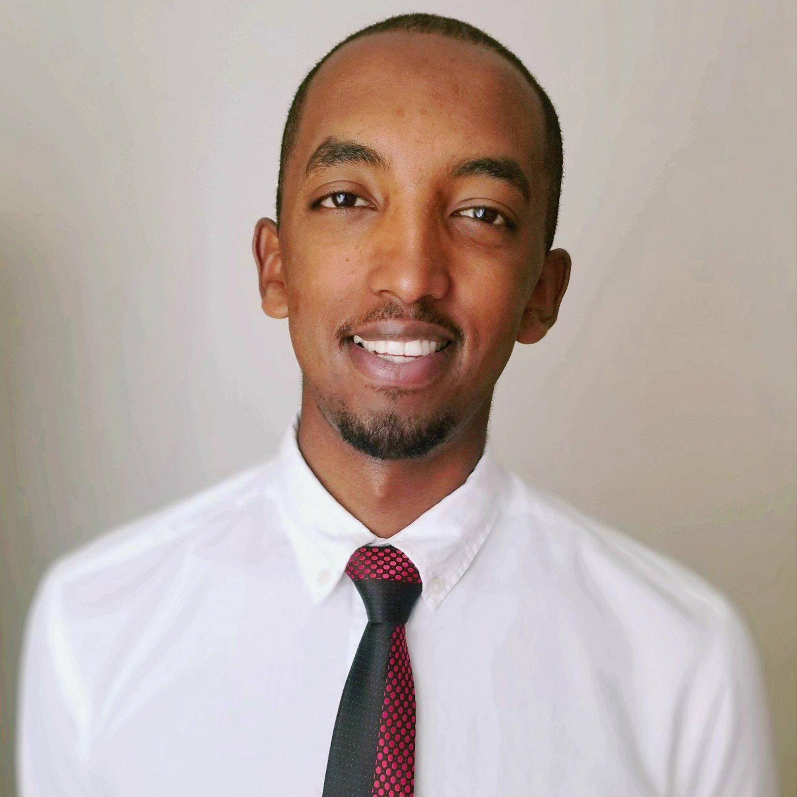

## Introduction

Welcome to my website! My name is Binyam Yilma, and I'm currently a 2nd year student at Columbia University's Mailman School of Public Health. My study focus is on Biostatistics within Public Health, and Comparative Effectiveness and Outcomes Research.


I love running, cooking, watching good films, chocolate, jazz and **Data Science**! 


This is me! 




## Resume
```{r out.width="100%", out.height="500", echo = FALSE}
knitr::include_graphics('files/Binyam_Yilma_Resume.pdf')
```

## Github & LinkedIn
* [Github](https://github.com/byilma)
* [Linkedin](https://www.linkedin.com/in/binyamyilma)
